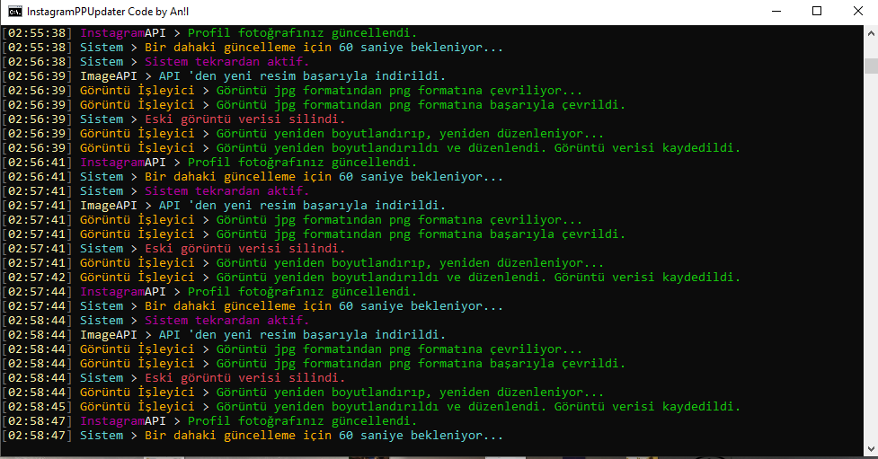

# Instagram PP Changer v1.3 
#  
Instagram profil fotoğrafınızı dakika başı o anki tarihe göre farklı resimler ile günceller.

**NOT:** *Yazılım beta sürecindedir. Hataları [@kodportali](https://www.instagram.com/kodportali/) instagram hesabı üzerinden bildirebilirsiniz.*

## Ekran Görüntüsü

---
## Gereksinimler

- PHP 7.2
  - ext-curl
  - ext-gd
  - ext-json
  - ext-zlib
  - ext-mbstring
  - ext-exif
  - [mgp25/instagram](https://github.com/mgp25/Instagram-API)

---

## Yazılım Kurulumu

**Windows**: Şimdilik sadece windows için büyük oranda otomatik olan sistem desteklenmektedir. Yapmanız gereken 'setup.cmd' dosyasını çalıştırmanız. 

---

## SSS

### Yazılımın Çalışma Mantığı Nedir?
Yazılım PHP tabanlı olarak çalışır. mgp25/instagram API 'si ile çalışır. Görüntüler tamamen random olarak gelir ve düzenlenir. Ardından Instagram profil fotoğrafınız güncellenir. Yazılım sadece komut arayüzünde çalışır.
    
### Hesap Bilgilerimiz Depolanıyor mu?
Hayır hesap verileriniz depolanmıyor. Tamamen sizin kendi bilgisayarınızda kalıyor. 3.parti sunuculara aktarılmıyor. Tamamen güvenlidir.
    
### Instagram Hesabıma Yazılımdan Nasıl Giriş Yapacağım?
config.json dosyasınde belirtilen yerlere kullanıcı adınız ve şifrenizi yazdığınız takdirde sistem otomatik olarak giriş yapıcaktır.
    
### Yazılımı Nasıl Çalıştıracağım?
Yazılımı buradan indirip kullandığınız platforma göre başlatın. Eğer windows kullanıyorsanız 'start.cmd' veya 'start.ps1' dosyasına çift tıklayıp çalıştırmanız yeterlidir. Linux kullanıcıları projeyi klonlayıp yazılımın kök dizinine gidip './start.sh' yazması yeterli olucaktır. Sadece komut arayüzünde (cli) çalışır. Ayrıca çalış tırmadan önce composer'i kurmayı unutmayınız.
    
   
### Yazılımı Bir Kere Çalıştırdıktan Sonra Kapatsak Sorun Olurmur?
Eğer her dakika güncellenmesini istiyorsanız yazılımın her daim açık kalması gerekir. Kapattığınız taktirde profil fotoğrafınızı değiştirmeyide durdurur. 
    
    
### Çalıştırdığımız Zaman PHP Extension Hatası Alıyorum, Neden?
Bunun sebebi gerekli php eklentilerinin kurulu olmamasıdır. Bunun için dosya içinde bulunan 'bin' dosyasını kullanın.
    
    
### cURL Hatası Alıyorum, Neden?
Proje içindeki 'bin/php/cacert.pem' dosyasının, dosya yolunu yine aynı 'bin/php' içindeki 'php.ini' dosyasındaki 'curl.cainfo' karşısına yapıştırın. 

### Kendi ülkemin zaman dilimini nasıl ayarlayabilirim?
'congig.json' dosyası içerisindeki 'timezone' değerini değiştirerek kendi ülkenin zaman dilimine ayarlayabilirsin. PHP tarafından desteklenen tüm zaman dilimleri için bu linke bakın: https://www.php.net/manual/tr/timezones.php

---
# LICENSE
[License](LICENSE)
---
